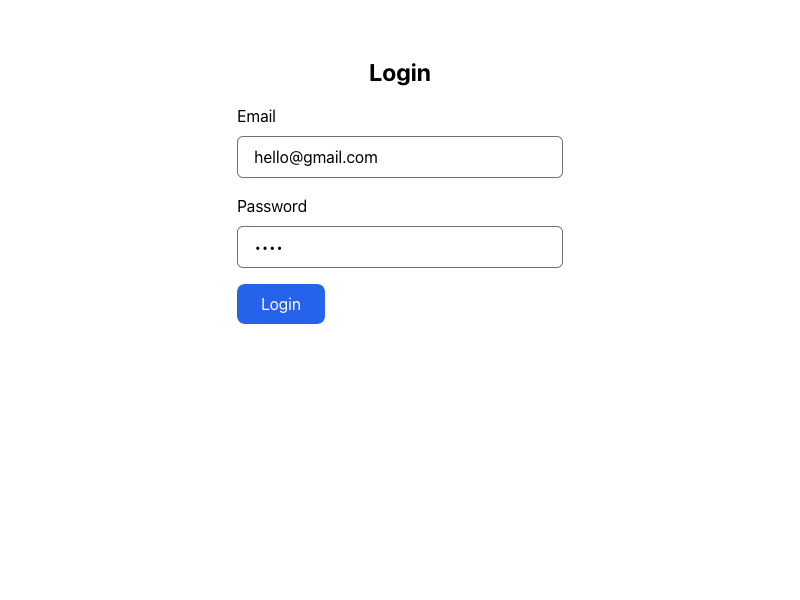
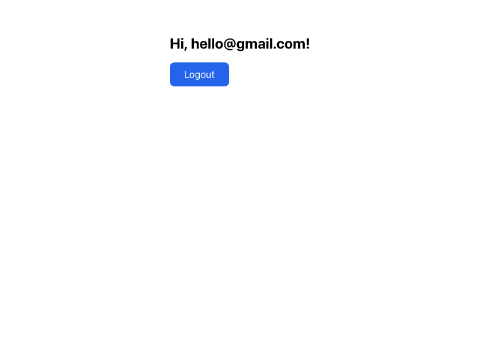
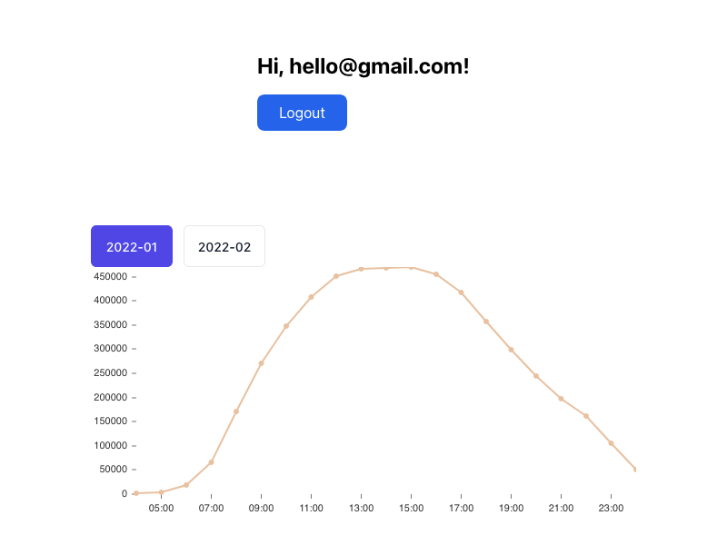
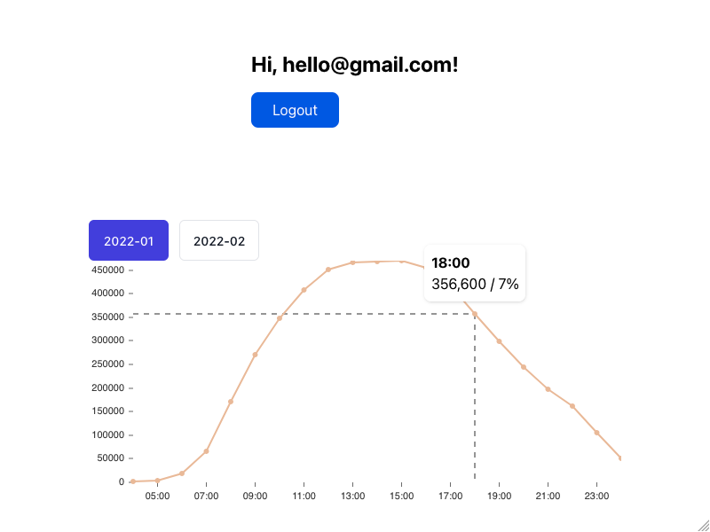
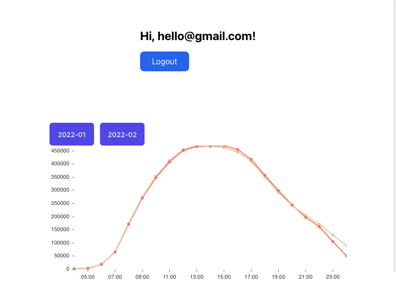

# Invenium Applications Template

We created this simple starter template to test your react and javascript knowledge.
In the repository you will find a working [Next.js](https://nextjs.org/) project that includes a very simple GraphQL API that can be consumed.

## Goals

### Login

We want you to create a simple login form that asks for a username and password. No validation required, every username and password combination is correct. The graphql API returns an token.

The graphql is defined like this:
```gql
query {
  login(username: "foo@bar.com", password: "test") {
    token
  }
}
```

The form can be easy as that:


### Logged In Validation

After you submitted your login credentials your logged in user should be welcomed via the requested login token.

You can use the api like this:
```gql
query {
  me(token: "eyJH....") {
    username
  }
}
```

**Bonus:** Persistent the token in the localStorage and restore the localStorage when re-opening the address. As well as displaying an logout button.

The result can look something like this:


### Data Visualization

For the next part we try to display a line-chart of the visitors per hour at a specific location - one of our basic visualizations. Here the x-axis should represent the hour of the day and the y-axis the sum of visitors.

The data can be fetched like that:
```gql
query {
  visitorsOverTime(where: { date: "2022-01" }) {
    time
    visitors {
      avg
      rel
      sum
    }
  }
}
```

**Bonus:** The data is available for January and February. Display a Radio Toggle so the user can switch between the two date ranges. On top of that - we would like to display the relative value in addition to the absolute value (sum) in the tooltip.

Here a example of what it can look like:



### Optional: Multiline Data Visualization

For our customers it is essential that they can spot differences easily. For that we want our date ranges to be displayed in the same line chart component.

Here is how it would look:


## Getting Started

First, clone and install the project

```sh
git clone https://github.com/invenium/invenium-applicants-template
cd invenium-applicants-template

npm install
# or
yarn
# or
pnpm i
```

Then, run the development server:

```sh
npm run dev
# or
yarn dev
# or
pnpm run dev
```

Open [http://localhost:3000](http://localhost:3000) with your browser to see the result.

You can start editing the page by modifying `pages/index.js`. The page auto-updates as you edit the file.

The Graphql API is available under `http://localhost:3000/api/graphql` - to test your requests you can open a GraphQL Sandbox via opening [http://localhost:3000/api/graphql](http://localhost:3000/api/graphql) within your browser

Please use every convention you are used to write your code, install every library you would like to use. Feel free to use inline styles or use classnames via the global.css, use the next.js css conventions or any other css library or convention you would like.